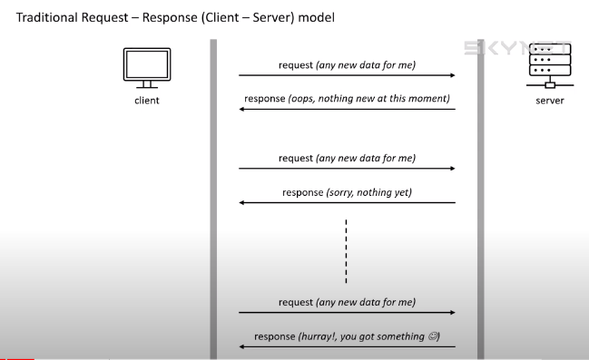
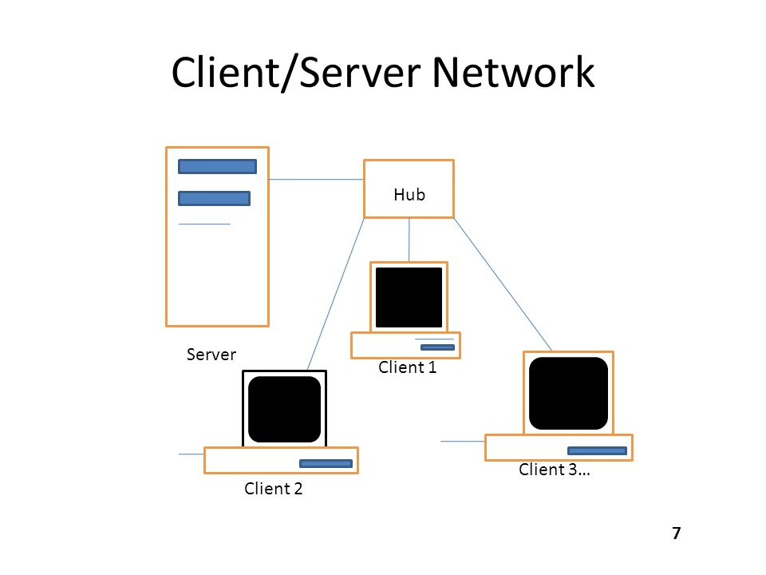
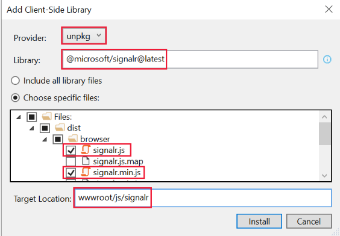

## Basic of SignalR
> SignalR is library which enable realtime between client and server.
<br/>

<p>SignalR dependency on request send from clinet to server to response at the same second</p>

## SignalR can be useful where :

<ul>
 <li>Gaming</li>
 <li>Social Network</li>
 <li>Voting</li>
 <li>GPS</li>
 <li>Maps</li>
 <li>Dashboards</li>
 <li>Travel Alerts</li>
 <li>Meeting App</li>
 </ul>

## RealTime Communication :

>SignalR Supports following Techniques for handling realtime.

<ul>
 <li>WebScoket</li>
 <li> Server Send Event</li>
 <li>logg Polling</li>
 </ul>

## Hubs 

> SignalR used Hubs to Communication Between Client And Server.



## Install SignalR in Asp.net core 6

<ol>
 <li>In Solution Explorer, right-click the project, and select Add > Client-Side Library.</li>
 <li>In the Add Client-Side Library dialog:
   <ul>
     <li>Select <b>unpkg</b> for Provider</li>
     <li>Enter <mark>@microsoft/signalr@latest</mark> for Library</li>
     <li>Select <b> Choose specific files</b>, expand the <i>dist/browser</i> folder, and select<mark>signalr.js and signalr.min.js.</mark></li>
     <li>Set Target Location to <i>wwwroot/js/signalr</i>/</li>
     <li><b>Select Install</b></li>
     </ul>
     </li>
     <li> </li>
     </ol>
     
     
     
     
   
     

     builder.Services.AddSignalR();
     app.MapHub<ChatHub>("/chatHub");


 
## ChatHub Class:


```bash
using Microsoft.AspNetCore.SignalR;
namespace Notifcations.Hubs {
    public class ChatHub:Hub {
        // send message to all users
        public async Task SendMessageToAllUsers(string user,string message)
        {
            await Clients.All.SendAsync("ReceiveMessage",user, message);
        }
    }
}
```
## Controller

```bash
using Microsoft.AspNetCore.Authorization;
using Microsoft.AspNetCore.Mvc;

namespace Notifcations.Controllers {
    [Authorize(Roles = "User")]
    public class ChattingController : Controller {
        public IActionResult Index()
        {
            return View();
        }
    }
}

```
## Index.cshtml

```bash
@{
    ViewData["Title"]="ChatDemo";
}
<section class="d-flex justify-content-between">
    <div class="row w-100">
        <form class="col-md-6 w-100">
            <div class="form-group">
                <label class="form-label">User:</label>
                <input type="text" class="form-control" id="txtUser" required />
            </div>
            <div class="form-group mt-3">
                <label class="form-label">Message:</label>
                <textarea cols="10" rows="10" class="form-control" id="txtMessage" required></textarea>
            </div>
            <div class="from-group mt-3">
                <input type="submit" class="btn btn-primary" id="btnSendMessage" />
            </div>
        </form>
    </div>
    <div class="w-100">
        <div class="row w-100">
            <ul id="messagesList" class="col-md-6" style="list-style-type:none;text-align:start;margin-left: 50px;">
            </ul>
        </div>
    </div>
</section>

```
     

## Chat.js


```bash
"use strict"
var connection = new signalR.HubConnectionBuilder().withUrl("/chatHub").build();
// Disabled Send button until connections is established
$("#btnSendMessage").prop("disabled", true);
connection.start().then(function () {
    $("#btnSendMessage").prop("disabled", false);
    console.log("Connection is established ChatHub");
}).catch(function (error) {
    return console.error(error.toString());
});
// Funcatinlity Client  to Server
$("#btnSendMessage").click(function (e) {
    var user = $("#txtUser").val();
    var mesg = $("#txtMessage").val();
    // To Server
    connection.invoke("SendMessageToAllUsers", user, mesg).catch(function (erro) {
        return console.error(erro.toString());
    });
    // clear message val
    $("#txtMessage").val('');
    // Focus again 
    $("#txtMessage").focus();
    // clear name
    $("#txtUser").val("");
    e.preventDefault();
});
// Response Server to client
connection.on("ReceiveMessage", function (user, text) {
    var connect = `<br/>${user}:${text}<br/>`;
    $("#messagesList").append(`<li>${connect}</li>`);
});


```
<a href="https://www.youtube.com/watch?v=_RepoZyMtL4&list=PLo-ZNwEHZHqbKSHEbpZX8u3X2WR1wlAH2&index=1">video....</a>
